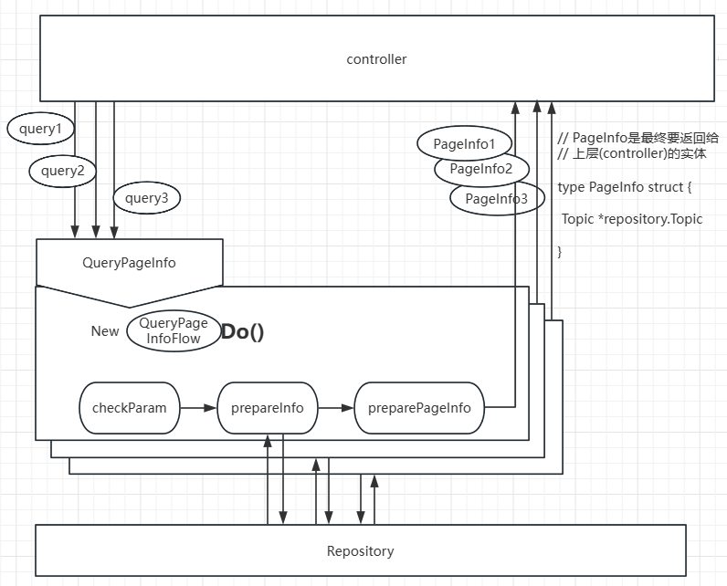

# 2-2 Go工程实践之测试

相关资料

- PPT链接 [‌⁤‌⁡⁡⁢⁢⁢⁢‌‍⁤‍⁡‍⁣⁢‌⁢⁢‬⁢⁤‬‌‌‌‬‍⁣‍⁣⁢‌‬‍⁤‌Go 语言入门 - 工程实践 - 赵征.pptx - 飞书云文档 (feishu.cn)](https://bytedance.feishu.cn/file/boxcnp0EHowxuLif7of3cBYxAmb)
- 官方预习文档 [【后端专场 学习资料一】字节跳动青训营 - 掘金 (juejin.cn)](https://juejin.cn/post/7188225875211452476#heading-8)

# Manual 

此次可操作手册以PPT顺序为主，建议大家对照着PPT一起阅读，并且跟着操作

## 03 测试

**由于忘记了测试是新一节课的内容，导致部分 03测试章节的内容留存在2-1中，未学习的读者需要自行往回翻阅**

### 案例10 - 依赖文件的单元测试

1. 新文件夹 `2-2-10file`，在内新建`file.go` 、`file_test.go`和`log.txt` 文件

2. log.txt

   ```
   line11
   line22
   line33
   ```

3. file.go 

   ```go
   package main
   
   import (
   	"bufio"
   	"fmt"
   	"os"
   	"strings"
   )
   
   func ReadFirstLine() string {
   	file, err := os.Open("log.txt")
   	defer file.Close()
   	if err != nil {
   		return ""
   	}
   	scanner := bufio.NewScanner(file)
   	for scanner.Scan() {
   		return scanner.Text()
   	}
   	return ""
   }
   
   func ProcessFirstLine() string {
   	line := ReadFirstLine()
   	destLine := strings.ReplaceAll(line, "11", "00")
   	return destLine
   }
   
   func main() {
   	line := ProcessFirstLine()
   	fmt.Println(line)
   }
   ```

4. file_test.go

   ```go
   package main
   
   import (
   	"github.com/stretchr/testify/assert"
   	"testing"
   )
   
   func TestProcessFirstLine(t *testing.T) {
   	firstLine := ProcessFirstLine()
   	assert.Equal(t, "line00", firstLine)
   }
   ```

5. 先运行 `go run file.go`查看效果

   ```shell
   src\2-2-10file> go run .\file.go
   line00
   ```

6. 再运行 `go test file.go file_test.go` 查看效果

   ```shell
   (base) PS D:\code\MoFishXiaodui\ExecutableManual\src\2-2-10file> go test .\file.go .\file_test.go
   ok      command-line-arguments  0.213s
   
   (base) PS D:\code\MoFishXiaodui\ExecutableManual\src\2-2-10file> go test .\file.go .\file_test.go --cover
   ok      command-line-arguments  0.227s  coverage: 69.2% of statements
   ```

7. 总结

   1. `ReadFirstLine` 函数可以读取 `log.txt` 文件并返回第一行
   2. `ProcessFirstLine` 函数可以调用 `ReadFirstLine` 函数获取第一行文本副本，并对该副本做加工，把"11"替换成"00"
   3. `TestProcessFirstLine` 函数用来测试 `ProcessFirstLine` 函数是否正确
   4. `ReadFirstLine` 函数的内容返回依赖于文件`log.txt`，如果`log.txt`被删除，就不能测试`ProcessFirstLine`的正确性。接下来的案例我们将设法替换 `ReadFirstLine`函数，使测试不依赖于 `log.txt`文件

### 案例11 - mock

mock 

- 为一个函数打桩
- 为一个方法打桩

此次mock需要用到"bou.ke/monkey"包

1. 复制[案例10](###案例10 - 依赖文件的单元测试)的整个文件夹，命名为:`2-2-11mock`，删掉`log.txt`文件。(把`ReadFirstLine`的依赖删除)

2. 添加monkey包，在终端运行`go get "bou.ke/monkey"`

   ```shell
   (base) PS D:\code\MoFishXiaodui\ExecutableManual\src\2-2-11mock> go get "bou.ke/monkey"
   go: added bou.ke/monkey v1.0.2
   ```

3. 修改`file_test.go`文件的测试函数代码。（就是在中间多了一个函数替换操作，也就是打桩）

   ```go
   // 原来
   func TestProcessFirstLine(t *testing.T) {
   	firstLine := ProcessFirstLine()
   	assert.Equal(t, "line00", firstLine)
   }
   
   // 现在
   func TestProcessFirstLine(t *testing.T) {
   	monkey.Patch(ReadFirstLine, func() string {
   		return "line11"
   	})
   	defer monkey.Unpatch(ReadFirstLine)
   
   	firstLine := ProcessFirstLine()
   	assert.Equal(t, "line00", firstLine)
   }
   ```

4. 最终代码见[src/2-2-11mock/](../src/2-2-11mock/)

5. 同[案例10](###案例10 - 依赖文件的单元测试)一样测试

   ```shell
   (base) PS D:\code\MoFishXiaodui\ExecutableManual\src\2-2-11mock> go test .\file.go .\file_test.go --cover 
   ok      command-line-arguments  0.218s  coverage: 23.1% of statements
   ```

6. 总结：mock可以通过替换函数的方式，从而可以删去部分依赖。


### 案例12 - 基准测试

1. 新建文件夹 `2-2-12bench` ，在内新建文件 `server.go` 和  `server_test.go`

2. 初始化，在 `2-2-12bench` 目录下执行 `go mod init server`

3. 在 `server.go`中写入代码

   ```go
   package bench
   
   import "math/rand"
   
   var ServerIndex [10]int
   
   // 初始化服务函数，（其实就是往数组里面各个项写入特定数字，i+100本身应该没什么含义）
   func InitServerIndex() {
   	for i := 0; i < 10; i++ {
   		ServerIndex[i] = i + 100
   	}
   }
   
   func Select() int {
   	// 随意选择一个服务器（随机选择一个数组元素，模拟随机一个服务器返回数字）
   	return ServerIndex[rand.Intn(10)]
   }
   ```

4. 在  `server_test.go` 中写入代码

   ```go
   package bench
   
   import "testing"
   
   func BenchmarkSelect(b *testing.B) {
   	InitServerIndex()
   	b.ResetTimer()
   
   	for i := 0; i < b.N; i++ {
   		Select()
   	}
   }
   
   // parallel 平行的，同时发生的
   func BenchmarkSelectParallel(b *testing.B) {
   	InitServerIndex()
   	b.ResetTimer()
   	b.RunParallel(func(pb *testing.PB) {
   		for pb.Next() {
   			Select()
   		}
   	})
   }
   ```

5. 最终代码见[src/2-2-12bench/](../src/2-2-12bench/)

6. 运行命令 `go test -bench=Ben`，查看效果。指令中`Ben`是指以`Ben`开头的测试函数都执行

   ```shell
   (base) PS D:\code\MoFishXiaodui\ExecutableManual\src\2-2-12bench> go test -bench=B
   goos: windows
   goarch: amd64
   pkg: server
   cpu: 12th Gen Intel(R) Core(TM) i5-12490F
   BenchmarkSelect-12              71638796                15.41 ns/op
   BenchmarkSelectParallel-12      28514331                42.61 ns/op
   PASS
   ok      server  2.562s
   
   # 只测并行
   (base) PS D:\code\MoFishXiaodui\ExecutableManual\src\2-2-12bench> go test -bench=BenchmarkSelectP
   goos: windows
   goarch: amd64
   pkg: server
   cpu: 12th Gen Intel(R) Core(TM) i5-12490F
   BenchmarkSelectParallel-12      27168068                43.41 ns/op
   PASS
   ok      server  1.399s
   ```


### 案例13 - 基准测试优化

1. 复制[案例12](###案例12 - 基准测试) 的 `2-2-12bench` 文件夹，重命名为  `2-2-13benchOptimize`

2. 在 `2-2-13bencOptimize`文件夹中执行命令， `go get "github.com/bytedance/gopkg@main"` 添加字节的gopkg

   ```shell
   (base) PS D:\code\MoFishXiaodui\ExecutableManual\src\2-2-13benchOptimize> go get "github.com/bytedance/gopkg@main"
   go: downloading github.com/bytedance/gopkg v0.0.0-20220118071334-3db87571198b
   go: added github.com/bytedance/gopkg v0.0.0-20220118071334-3db87571198b
   ```

3. 在文件 `server.go`中导入字节的fastrand包

   ```go
   import "github.com/bytedance/gopkg/lang/fastrand"
   ```

   这里说一下是怎么知道在路径 `gopkg/lang/fastrand`

   方法一：

   - 当你执行go get 命令后，你可以去 `$GOPATH/pkg/mod`找到你下载的包，然后在里面查找就能找到`fastrand`包的位置
   - 如果你不知道你的 `$GOPATH`在哪，你可以在终端输入`go env` 确定

   方法二（其实我也是用方法二的时候才确定用方法一再找一遍的）：

   - 我直接看课件的实例代码 [go-project-example/benchmark/load_balance_selector.go at V0 · Moonlight-Zhao/go-project-example (github.com)](https://github.com/Moonlight-Zhao/go-project-example/blob/V0/benchmark/load_balance_selector.go)

4. 修改下方的随机选择服务器代码中的随机函数为快速随机函数

   ```go
   // 原来
   return ServerIndex[rand.Intn(10)]
   
   // 现在
   return ServerIndex[fastrand.Intn(10)]
   ```

5. 与[案例12](###案例12 - 基准测试)一样进行测试

   ```shell
   (base) PS D:\code\MoFishXiaodui\ExecutableManual\src\2-2-13benchOptimize> go test -bench=B
   goos: windows
   goarch: amd64
   pkg: server
   cpu: 12th Gen Intel(R) Core(TM) i5-12490F
   BenchmarkSelect-12              523615494                2.292 ns/op
   BenchmarkSelectParallel-12      1000000000               0.3863 ns/op
   PASS
   ok      server  2.039s
   ```

6. 可以发现这比[案例12](###案例12 - 基准测试)要快很多


## 04 实践

### 案例14 - 克隆老师的社区话题页面案例进行测试

因为这是一个完整的仓库，且此次案例不需要我们写代码，所以这里只放链接，就不把仓库代码放到这里了。

[Moonlight-Zhao/go-project-example at V0 (github.com)](https://github.com/Moonlight-Zhao/go-project-example/tree/V0)

注意，我们**只用分支 V0** 上面的代码，主分支的代码需要用到数据库，不方便初学者测试。大家主要克隆代码时只克隆V0上的代码就行。

你可以克隆主分支后再切到V0分支，然后拉取V0分支。

也可以直接只克隆V0分支

#### 附上GPT的解答：

问：git clone 如何只克隆特定分支？

ChatGPT：

要克隆一个特定分支而不是整个仓库，可以使用Git的`-b`选项来指定要克隆的分支。以下是在`git clone`命令中使用`-b`选项的示例：

```bash
git clone -b branch_name repository_url
```

其中：

- `branch_name`是你要克隆的特定分支的名称。
- `repository_url`是你要克隆的远程仓库的URL。

例如，如果你想克隆一个名为`development`的特定分支，仓库的URL为`https://github.com/example/repo.git`，你可以执行以下命令：

```bash
git clone -b development https://github.com/example/repo.git
```

这将只克隆`development`分支的内容到你的本地目录中，而不会包含其他分支和提交历史。

#### 开始实操

1. 找一个合适的位置，执行 `git clone -b V0 git@github.com:Moonlight-Zhao/go-project-example.git `

2. 然后在项目根目录上执行`go run server.go`

3. 当看到终端输出`[GIN-debug] Listening and serving HTTP on :8080`时，即为启动成功。

4. 先去浏览器查看`localhost:8080`，可以看到404，这是因为代码没有配置根路由的处理函数，默认404了。

5. 为了找到有用的路由，我们可以到`server.go`中查看gin的路由处理函数

   ```go
   r.GET("/community/page/get/:id", func(c *gin.Context) {
       topicId := c.Param("id")
       data := cotroller.QueryPageInfo(topicId)
       c.JSON(200, data)
   })
   ```

6. 从上面的代码中，可以看到gin引擎r可以处理路径为 `/community/page/get/:id`的GET请求。于是尝试在浏览器访问：[localhost:8080/community/page/get/1](http://localhost:8080/community/page/get/1)，既可以看到响应数据，然后请自行把id换成2和3等进行测试。

7. 这些数据来源于根目录data文件夹下的topic文件。请尝试修改以及增加数据。

8. 当你修改了文件夹的数据后，刷新浏览器并不能直接看到新数据，需要你关掉服务再执行命令`go run server.go`开启服务


### 案例15 - 动手复刻社区话题页面案例

此次案例代码代码量颇多，分多个章节进行。

#### 初始化项目

1. 新建文件夹 `2-2-15web`作为项目的**根目录**（本案例中说的根目录都是指这个文件夹下）
2. 在 `2-2-15web`目录下执行`go mod init web`

#### 构建data和repository层

说明

- data 存放数据本身
- repository 放直接操作data数据的代码，形成模型(model)供上层业务调用

1. 在项目根目录新建文件夹 data 和 repository

2. 在data里面新建文件topic，写入如下数据（单独每一行作json数据），但并非整个文件作为json文件

   ```json
   {"id":1, "title":"青训营来啦1", "content":"冲冲冲！", "create_time":"20230804150505"}
   {"id":2, "title":"青训营来啦2", "content":"冲冲冲！", "create_time":"20230804150506"}
   {"id":3, "title":"青训营来啦3", "content":"冲冲冲！", "create_time":"20230804150605"}
   {"id":4, "title":"青训营来啦4", "content":"冲冲冲！", "create_time":"20230804150705"}
   ```

3. 在repository文件夹下新建文件topic.go，这里存放操作topic数据的代码

   1. 在topic.go内部写入代码如下

   2. ```go
      // 注意包名是repository
      package repository
      
      // 1-先声明一个结构体，json导出和 data/topic 的内容 对应上
      type Topic struct {
      	Id         int64  `json:"id"`
      	Title      string `json:"title"`
      	Content    string `json:"content"`
      	CreateTime string `json:"create_time"`
      }
      
      // 2-创建索引表。可以快速通过Id值找到对应的Topic
      var topicIndexMap map[int64]*Topic
      
      // 3-InitTopicIndexMap 初始化话题索引
      // 如果要规范的话，后面要设置成不可导出（即小写字母开头，但是为了方便测试，先用着大写字母开头）
      func InitTopicIndexMap(filePath string) error {
      	// 尝试打开文件
      	file, err := os.Open(filePath + "topic")
      	if err != nil {
      		return err
      	}
      
      	scanner := bufio.NewScanner(file)
      	// 为临时topic索引分配空间
      	topicTmpMap := make(map[int64]*Topic)
      
      	fmt.Println("开始读取数据")
      
      	// 读取文本
      	for scanner.Scan() {
      		text := scanner.Text()
      		fmt.Println(text)
      
      		// 新建单个Topic结构
      		var topic Topic
      
      		// 转换text填充数据到topic上
      		if err := json.Unmarshal([]byte(text), &topic); err != nil {
      			return err
      		}
      
      		// 把topic指针添加到临时索引表上
      		topicTmpMap[topic.Id] = &topic
      	}
      	// 把 临时索引表 赋给 最终的索引表
      	topicIndexMap = topicTmpMap
      
      	return nil
      }
      ```

4. 为了能够测试上面代码的正确性，提供一下两个方法进行判断，建议先用方法一，后面再用方法二。因为方法二不能看到读取文件的过程。

   1. 方法1

      1. 在根目录新建test文件夹，再在内新建testRepositoryTopic.go文件

      2. 写入代码如下

         ```go
         package main
         
         import (
         	"fmt"
             
             // 这个web来自于go mod init时写的模块名，repository就是根目录下的repository包
         	"web/repository"
         )
         
         func main() {
         	err := repository.InitTopicIndexMap("../data/")
         	fmt.Println("err", err)
         }
         ```

      3. 然后直接运行，会逐行输出读取的内容，说明写成功了

         ```shell
         (base) PS D:\code\MoFishXiaodui\ExecutableManual\src\2-2-15web\test> go run .\testRepositoryTopic.go
         开始读取数据
         {"id":1, "title":"青训营来啦1", "content":"冲冲冲！", "create_time":"20230804150505"}
         {"id":2, "title":"青训营来啦2", "content":"冲冲冲！", "create_time":"20230804150506"}
         {"id":3, "title":"青训营来啦3", "content":"冲冲冲！", "create_time":"20230804150605"}
         {"id":4, "title":"青训营来啦4", "content":"冲冲冲！", "create_time":"20230804150705"}
         err <nil>
         ```

   2. 方法二

      1. 在根目录执行 `go get "github.com/stretchr/testify/assert"`添加包

      2. 在repository文件夹下新建topic_test.go文件，写入以下代码

         ```go
         package repository
         
         import (
         	"testing"
         
         	"github.com/stretchr/testify/assert"
         )
         
         func TestInitTopicIndexMap(t *testing.T) {
         	var expect error = nil
         	output := InitTopicIndexMap("../data/")
         	assert.Equal(t, expect, output)
         }
         ```

      3. 在根目录下执行 ` go test .\repository\`可以看到测试结果。

5. 有关topic的repository层到此就做完了

#### 构建service层

先看我画的这张草图，了解我们的service层是怎样与联系controller层和repository层的



看完这个，可以直接开始看代码

1. 在根目录下新建service文件夹，再在内新建文件 `query_page_info.go`

2. 在文件 `query_page_info.go`，该文件包名为service，然后导入包`import "web/repository"

3. 写入以下代码

  ```go
  package service
  
  import (
      "errors"
      "sync"
      "web/repository"
  )
  
  // PageInfo是最终要返回给上层(controller)函数的实体
  type PageInfo struct {
      Topic *repository.Topic
  }
  
  // 处理请求内容和生成数据的结构体
  type QueryPageInfoFlow struct {
      // 接收上层传来的topicId
      topicId int64
  
      // 组装的PageInfo实体，用来返回给上层
      pageInfo *PageInfo
  
      // 下面是获取散装的模型数据
      topic *repository.Topic // topic
      // 以后再添加 post 模型
  }
  
  // 用来检查参数的函数
  func (f *QueryPageInfoFlow) checkParam() error {
      if f.topicId <= 0 {
          return errors.New("topic id must be larger than 0")
      }
      return nil
  }
  
  // 用来通过底层模型获取对应数据的函数
  func (f *QueryPageInfoFlow) prepareInfo() error {
      var wg sync.WaitGroup
      wg.Add(1)
  
      // 获取topic信息
      go func() {
          defer wg.Done()
          topic := repository.NewTopicDaoInstance().QueryTopicById(f.topicId)
          f.topic = topic
      }()
  
      // 获取post信息先不写
      wg.Wait()
      return nil
  }
  
  // 用来组装成PageInfo实体的函数
  func (f *QueryPageInfoFlow) preparePageInfo() error {
      f.pageInfo = &PageInfo{
          Topic: f.topic,
      }
      return nil
  }
  
  // 外部来了一个请求，我们创建一个新的QueryPageInfoFlow结构来处理，这个结构的Do()方法最终返回想要的结果
  func QueryPageInfo(topicId int64) (*PageInfo, error) {
      return NewQueryPageInfoFlow(topicId).Do()
  }
  
  // 创建新QueryPageInfoFlow实例的函数
  func NewQueryPageInfoFlow(topicId int64) *QueryPageInfoFlow {
      return &QueryPageInfoFlow{
          topicId: topicId,
      }
  }
  
  // Do函数封装了检查参数、获取数据、组装实体三个步骤，并返回PageInfo
  func (f *QueryPageInfoFlow) Do() (*PageInfo, error) {
      if err := f.checkParam(); err != nil {
          return nil, err
      }
      if err := f.prepareInfo(); err != nil {
          return nil, err
      }
      if err := f.preparePageInfo(); err != nil {
          return nil, err
      }
      return f.pageInfo, nil
  }
  ```

4. 在service文件夹下新建一个测试文件`query_page_info_test.go`，在内写入文件：

  ```go
  package service
  
  import (
  	"github.com/stretchr/testify/assert"
  
  	"os"
  	"testing"
  	"web/repository"
  )
  
  func TestMain(m *testing.M) {
  	repository.InitTopicIndexMap("../data/")
  	os.Exit(m.Run())
  }
  
  func TestQueryPageInfo(t *testing.T) {
  	pageInfo, _ := QueryPageInfo(1)
  	assert.Equal(
  		t,
  		PageInfo{Topic: &repository.Topic{Content: "冲冲冲！"}}.Topic.Content,
  		pageInfo.Topic.Content,
  	)
  }
  ```

5. 在根目录执行命令 `go test service`进行测试，然后把`冲冲冲`换成`冲冲冲！`（中文感叹号）再测试一次

  ```shell
  # 冲冲冲
  (base) PS D:\code\MoFishXiaodui\ExecutableManual\src\2-2-15web> go test .\service\
  开始读取数据
  {"id":1, "title":"青训营来啦1", "content":"冲冲冲！", "create_time":"20230804150505"}
  {"id":2, "title":"青训营来啦2", "content":"冲冲冲！", "create_time":"20230804150506"}
  {"id":3, "title":"青训营来啦3", "content":"冲冲冲！", "create_time":"20230804150605"}
  {"id":4, "title":"青训营来啦4", "content":"冲冲冲！", "create_time":"20230804150705"}
  --- FAIL: TestQueryPageInfo (0.00s)
      query_page_info_test.go:18: 
                  Error Trace:    D:/code/MoFishXiaodui/ExecutableManual/src/2-2-15web/service/query_page_info_test.go:18
                  Error:          Not equal:
                                  expected: "冲冲冲"
                                  actual  : "冲冲冲！"
  
                                  --- Expected
                                  +++ Actual
                                  @@ -1 +1 @@
                                  -冲冲冲
                                  +冲冲冲！
                  Test:           TestQueryPageInfo
  FAIL
  FAIL    web/service     0.219s
  FAIL
  
  # 冲冲冲！
  (base) PS D:\code\MoFishXiaodui\ExecutableManual\src\2-2-15web> go test .\service\
  ok      web/service     (cached)
  
  # 测试成功
  ```

#### 构建controller层

本层代码提供最后一层的封装控制。本次案例涉及逻辑不多，此次controller层仅是封装一个 通过string类型的topicId获取topic 的函数，逻辑不复杂。读者认真完成service层为关键。

1. 在根目录新建controller文件夹，再在内新建`query_page_info.go` 文件（与service层的文件同名，你若改成其他文件名当然也是可以的）。

2. 在`query_page_info.go`内书写以下代码

   ```go
   package controller
   
   import (
   	"strconv"
   	"web/service"
   )
   
   type PageData struct {
   	Code int64       `json:"code"` // 状态码
   	Msg  string      `json:"msg"`  // 成功/错误信息
   	Data interface{} `json:"data"` // 数据
   }
   
   func QueryPageInfo(topicIdStr string) *PageData {
   	// 将string类型的topicIdStr转换为int64类型的topicId
   	topicId, err := strconv.ParseInt(topicIdStr, 10, 64)
   	if err != nil {
   		return &PageData{
   			Code: -1,
   			Msg:  err.Error(),
   		}
   	}
   	pageInfo, err := service.QueryPageInfo(topicId)
   	if err != nil {
   		return &PageData{
   			Code: -1,
   			Msg:  err.Error(),
   		}
   	}
   	return &PageData{
   		Code: 0,
   		Msg:  "success",
   		Data: pageInfo,
   	}
   }
   ```

3. 新建测试文件 `query_page_info_test.go`中书写以下代码

   ```go
   package controller
   
   import (
   	"github.com/stretchr/testify/assert"
   
   	"os"
   	"testing"
   	"web/repository"
   )
   
   func TestMain(m *testing.M) {
   	repository.InitTopicIndexMap("../data/")
   	os.Exit(m.Run())
   }
   
   func TestQueryPageInfo(t *testing.T) {
   	pageData := QueryPageInfo("1")
   	assert.Equal(
   		t,
   		int64(0),
   		pageData.Code,
   	)
   }
   ```

4. 测试方法不再赘述。在TestQueryPageInfo中可以修改 int64() 内的值进行测试

   ```shell
   # int64(0)
   (base) PS D:\code\MoFishXiaodui\ExecutableManual\src\2-2-15web> go test .\controller\
   ok      web/controller  0.224s
   
   # int64(-1)
   (base) PS D:\code\MoFishXiaodui\ExecutableManual\src\2-2-15web> go test .\controller\
   开始读取数据
   {"id":1, "title":"青训营来啦1", "content":"冲冲冲！", "create_time":"20230804150505"}
   {"id":2, "title":"青训营来啦2", "content":"冲冲冲！", "create_time":"20230804150506"}
   {"id":3, "title":"青训营来啦3", "content":"冲冲冲！", "create_time":"20230804150605"}
   {"id":4, "title":"青训营来啦4", "content":"冲冲冲！", "create_time":"20230804150705"}
   --- FAIL: TestQueryPageInfo (0.00s)
       query_page_info_test.go:18:
                   Error Trace:    D:/code/MoFishXiaodui/ExecutableManual/src/2-2-15web/controller/query_page_info_test.go:18
                   Error:          Not equal:
                                   expected: -1
                                   actual  : 0
                   Test:           TestQueryPageInfo
   FAIL
   FAIL    web/controller  0.214s
   FAIL
   ```

   

#### 提供Web服务

- 参考gin文档[文档 | Gin Web Framework (gin-gonic.com)](https://gin-gonic.com/zh-cn/docs/)

我们本次实验使用gin框架来提供web服务。

1. 在根目录新建 `server.go` 文件，然后去看上面的Gin框架文档的入门指南

2. 在根目录执行安装命令 `go get -u github.com/gin-gonic/gin`

3. 把Gin快速案例代码copy到 `server.go` 上面，然后直接运行

   ```go
   package main
   
   import "github.com/gin-gonic/gin"
   
   func main() {
   	r := gin.Default()
   	// 路由器url - ping
   	r.GET("/ping", func(c *gin.Context) {
   		// - 200 是请求成功状态码，问就是规定200是成功，404是page not found
   		// - type gin.H map[string]any
   		// c.JSON 快速使用map或者struct返回json数据
   		// c.JSON serializes the given struct as JSON into the response body.
            // It also sets the Content-Type as "application/json".
   		c.JSON(200, gin.H{
   			"message": "pong",
   		})
   	})
   	r.Run() // 监听并在 0.0.0.0:8080 上启动服务
   }
   ```

4. 导入repository包，书写数据初始化的代码

   ```go
   import "web/repository"
   
   func main() {
   	err := repository.InitTopicIndexMap("./data/")
   	if err != nil {
   		fmt.Println("初始化数据出错")
   		os.Exit(-1)
   	}
       /* ... */
   }
   ```

5. 导入controller包，仿照第一个r.GET代码，书写自己逻辑代码

   ```go
   r.GET("/topic/:id", func(c *gin.Context) {
       // 获取id参数
       topicId := c.Param("id")
       // 通过controller层的QueryPageInfo函数找Topic相关数据
       data := controller.QueryPageInfo(topicId)
       // 直接把数据返回
       c.JSON(200, data)
   })
   // r.Run() // 默认监听并在 0.0.0.0:8080 上启动服务
   r.Run(":9000") // 指定在9000端口上 启动服务
   ```

6. 直接运行进行测试

7. 在浏览器依次测试以下链接

   - http://localhost:9000
   - http://localhost:9000/ping
   - http://localhost:9000/topic/2
   - http://localhost:9000/topic/5

到此，有关topic内容的查询服务 从底部到web服务 都搭建好了。

接下来完善有关post内容的查询服务

预告

#### 技能已讲解，可以参考老师代码自主完善post内容作为练习了


#### 技能已学成，可以搭建web服务给你的hxd提供web问候了

