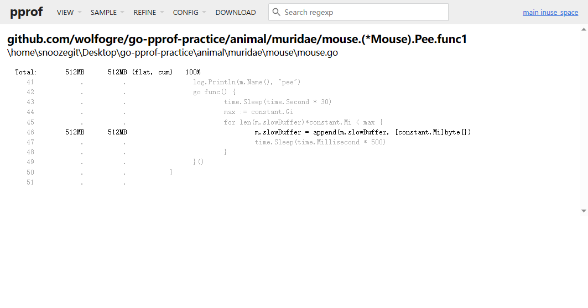
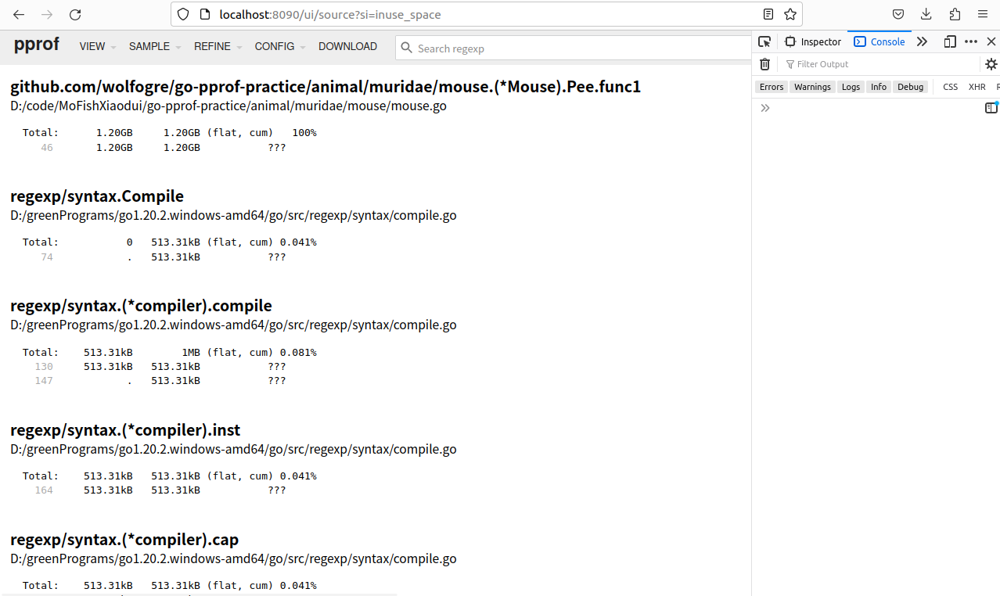

# 3-2性能调优实战

**相关链接**

- PPT：[‌‌‌‌‬⁡⁤⁢⁢⁢‌⁡⁤‌⁤⁡‍⁤‬⁢⁡⁣⁢‬⁤⁡⁤‌‬⁤‬‍‬‬⁣⁢高质量编程与性能调优实战 .pptx - 飞书云文档 (feishu.cn)](https://bytedance.feishu.cn/file/boxcn7AkvSWnRkHEttsuYHqW24g)
- 官方学习资料：[【后端专场 学习资料一】字节跳动青训营 - 掘金 (juejin.cn)](https://juejin.cn/post/7188225875211452476#heading-26)

# Manual

性能调优原则
- 要依靠数据不是猜测
- 要定位最大瓶颈而不是细枝末节
- 不要过早优化
- 不要过度优化

## pprof

pprof工具

> - 工具-Tool
>   - runtime/pprof
>   - net/http/pprof
> - 采样-Sample
>   - CPU
>     - 采样对象：函数调用和它们占用的时间
>     - 采样率：100次秒，固定值
>     - 采样时间：从手动启动到手动结束
>   - 堆内存-Heap
>     - 指标: alloc_space, alloc_objects, inuse_space, inuse_objects
>     - 计算方式: inuse=alloc-free
>   - 协程-Goroutine
>     - Goroutine - 记录所有用户发起且在运行中的goroutine(即入口非runtime开头的)runtime.main的调用栈信息
>     - ThreadCreate - 记录程序创建的所有系统线程的信息
>   - 锁-Mutex
>     - 采样争抢锁的次数和耗时
>     - 采样率：只记录固定比例的锁操作，1为每次加锁均记录
>   - 阻塞-Block
>     - 采样阻塞操作的次数和耗时
>     - 采样率：阻塞耗时超过阈值的才会被记录1为每次阻塞均记录
>   - 线程创建-ThreadCreate
> - 分析-Profile
>   - 网页
>   - 可视化终端
> - 展示-View
>   - Top
>   - 调用图-Graph
>   - 火焰图-FlameGraph
>   - Peek
>   - 源码-Source
>   - 反汇编-Disassemble

这一节课的内容很陌生，要写的代码也不多。由于老师讲的还算详细，所以本节手册不带大家实操，而是大家自己去跟着老师实操。下面是针对我在跟着老师实操时遇到的一些问题的解决方案，有一些问题也没有彻底解决，需要大家也帮忙尝试。

- 先拉取课程仓库代码[wolfogre/go-pprof-practice: go pprof practice. (github.com)](https://github.com/wolfogre/go-pprof-practice)，运行起来，在浏览器查看`http://localhost:6060/debug/pprof`的内容
- ```shell
  # 爬取10秒的数据，然后可以执行相关命令查看性能情况
  go tool pprof "http://localhost:6060/debug/pprof/profile?seconds=10"
  ```
- ```shell
  # 以web形式呈现各种数据
  go tool pprof -http=:8080 "http://localhost:6060/debug/pprof/heap"
  ```


#### 解决pprof无法使用dot生成图片的问题

>(pprof) web failed to execute dot. Is Graphviz installed? Error: exec: "dot": executable file not found in %PATH%

ChatGPT：

>这个错误提示是由于你尝试在使用`pprof`工具生成图形报告时，它需要使用Graphviz来可视化数据，但是系统没有找到Graphviz的可执行文件。
>Graphviz是一个开源的图形可视化工具集，用于生成图形和图表。在使用`pprof`的web界面时，它会尝试生成DOT格式的图，然后使用Graphviz的`dot`工具来将DOT图转换为实际的图像。
>要解决这个问题，你需要安装Graphviz并将其添加到系统的`PATH`中。以下是一些常见操作系统的安装方法：
>
>#### 在 Ubuntu 上安装 Graphviz：
>```bash
>sudo apt-get update
>sudo apt-get install graphviz
>```
>#### 在 CentOS 上安装 Graphviz：
>```bash
>sudo yum install graphviz
>```
>#### 在 macOS 上安装 Graphviz：
>如果你使用Homebrew，可以运行以下命令安装Graphviz：
>```bash
>brew install graphviz
>```
>#### 在 Windows 上安装 Graphviz：
>在 Windows 上安装 Graphviz 可以参考官方下载页面：https://www2.graphviz.org/Packages/stable/windows/
>安装完成后，将 Graphviz 的 `bin` 目录添加到系统的 `PATH` 中。这样，`pprof` 就能够找到 `dot` 可执行文件并生成图形报告了。
>请注意，有时需要重新启动终端会话或IDE，以使新的 `PATH` 设置生效。

我在Windows上的操作：

到graphviz windows 64位下载地址 https://www2.graphviz.org/Packages/stable/windows/10/cmake/Release/x64/ 下载，安装好后（安装时记得勾选把路径添加到path）在cmd(**管理员模式**)运行以下命令

```shell
# 通过查看dot版本来确认graphviz安装成功
dot -v

# 执行以下命令，为了能够在pprof中正常调用web命令，生成图片
dot -c
```

```shell
(base) PS D:\code\MoFishXiaodui\go-pprof-practice> go tool pprof "http://localhost:6060/debug/pprof/profile?seconds=10"
Fetching profile over HTTP from http://localhost:6060/debug/pprof/profile?seconds=10
Saved profile in C:\Users\Snooze-Lee\pprof\pprof.main.exe.samples.cpu.015.pb.gz
File: main.exe
Build ID: C:\Users\SNOOZE~1\AppData\Local\Temp\go-build4004747932\b001\exe\main.exe2023-08-08 17:52:27.0393953 +0800 CST
Type: cpu
Time: Aug 8, 2023 at 5:52pm (CST)
Duration: 10s, Total samples = 20ms (  0.2%)
Entering interactive mode (type "help" for commands, "o" for options)
(pprof)
```

```shell
go tool pprof -http=:8080 "http://localhost:6060/debug/pprof/heap"
Fetching profile over HTTP from http://localhost:6060/debug/pprof/heap
Saved profile in C:\Users\Snooze-Lee\pprof\pprof.main.exe.alloc_objects.alloc_space.inuse_objects.inuse_space.003.pb.gz
Serving web UI on http://localhost:8080
```

 

#### source视图不显示相关代码的问题

这个问题很玄学，我至今没搞明白。

我在Windows跑了程序，但是在Windows本地运行pprof可以抓取其他数据但抓取不到代码。我在Ubuntu跑了程序，在Ubuntu本地运行pprof抓取不到代码。

- windows抓取ubuntu
  - 
- windows抓取windows
  - 
- ubuntu抓取windows
  - 
- ubuntu抓取ubuntu
  - 

这玩意已经搞了三天了，不想搞了，感觉也没什么收获。


## 预告：在自己的项目中使用pprof
