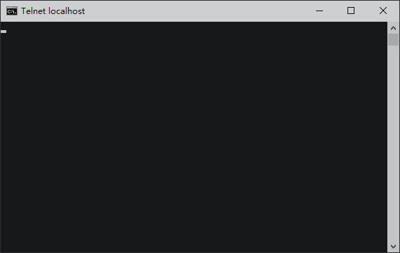
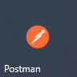
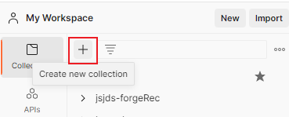
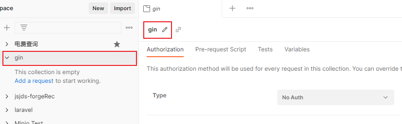
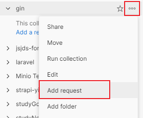
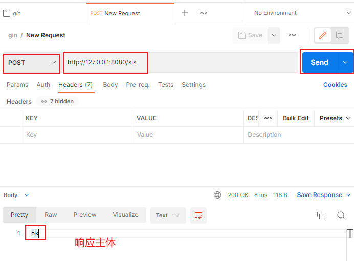
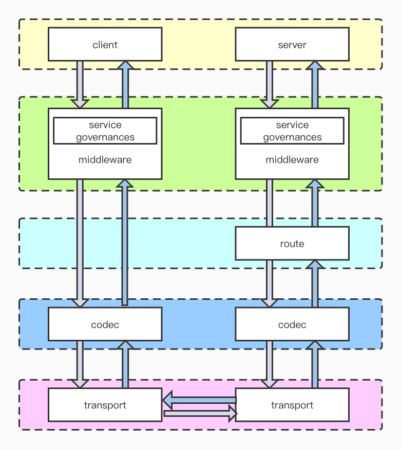
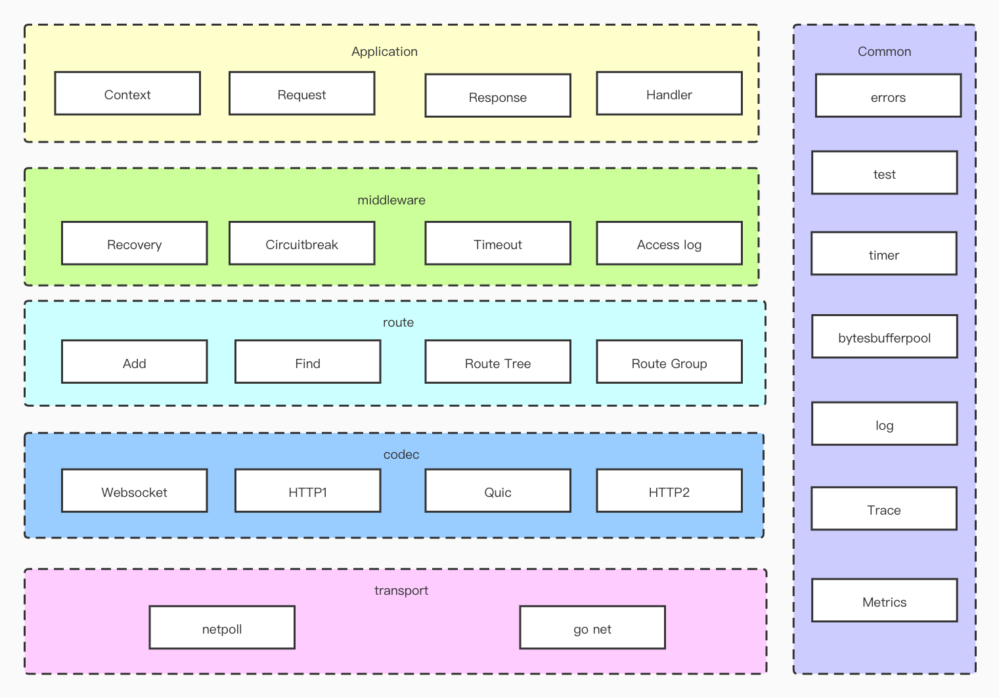
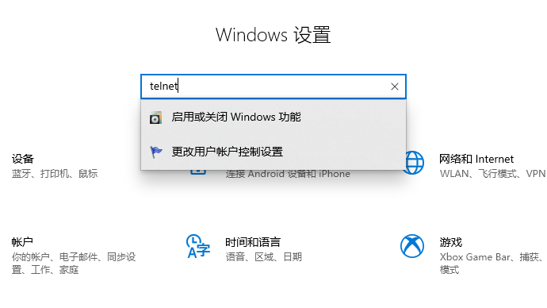
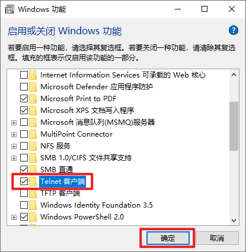

# HTTP协议

# Manual

## 01再谈HTTP协议-前置知识-gin框架

### 案例4-1创建一个gin服务

这部分ppt没有讲，这里先做这个服务，为下一个案例做准备

1. 新建文件夹 `4-1gin`，作为项目根目录

2. 根目录上运行 `go mod init ginServer`

3. 运行 `go get -u github.com/gin-gonic/gin`加载包

4. 在根目录创建 `main.go`

5. 在main.go中写入

   ```go
   package main
   
   import "github.com/gin-gonic/gin"
   
   func main() {
   	r := gin.Default()
   	r.GET("/ping", func(c *gin.Context) {
   		c.JSON(200, gin.H{
   			"message": "pong",
   		})
   	})
   	r.Run() // 监听并在 0.0.0.0:8080 上启动服务
   }
   ```

6. 直接运行

7. 到浏览器查看 `localhost:8080/ping` 的结果，若能看到 `{"message":"pong"}`则说明服务启动成功

### 案例4-2发送报文

本次案例采用telnet发送报文作为测试

1. 启动案例4-1的gin服务

2. cmd运行 `telnet localhost 8080`，会显示出

3. 如果telnet没有安装，需要自行安装，参考下文附录[Windows安装telnet](##Windows安装telnet)

4. 如果如前面所示显示会话框等待输入，那么可以进行一下操作：

5. 首先按下快捷键 `ctrl+]` 打开回显，然后再按回车回到会话框。如果你没有开回显的话，你在会话框输入的内容会直接传到服务器上，但没有显示出来，你不能确定自己输入了什么

6. 接下来输入以下语句，注意，不要敲错，不支持BackSpace键删除，你输入的每一个字符都是会马上传到服务器

   ```http
   GET /ping HTTP/1.1
   host: localhost
   
   ```

   输入完指令敲两个回车（第一次的回车是为了标识分开headers信息和body信息，第二次回车就结束报文了）

7. 然后可以看到gin服务传回来的json数据

   ```cmd
   GET /ping HTTP/1.1
   host: localhost
   
   HTTP/1.1 200 OK
   Content-Type: application/json; charset=utf-8
   Date: Fri, 11 Aug 2023 03:29:20 GMT
   Content-Length: 18
   
   {"message":"pong"}
   ```

### 案例4-3发送post报文

1. 复制案例4-1的文件夹，改名为4-3postGin

2. 在main.go中新增一个post请求的处理方法

   ```go
   r.POST("/sis", func(c *gin.Context) {
       c.Data(200, "text/plain; charset=utf-8", []byte("ok"))
   })
   ```

3. 直接运行

4. cmd执行`telnet localhost 8080`进入会话框，关闭回显，发送报文如下

   ```http
   POST /sis HTTP/1.1
   host: 127.0.0.1
   ```

5. 测试结果

   ```shell
   POST /sis HTTP/1.1	# 请求行
   host: 127.0.0.1		# 请求头部 host
   
   HTTP/1.1 200 OK		# 响应行
   Content-Type: text/plain; charset=utf-8	# 响应头部 内容/文件类型
   Date: Fri, 11 Aug 2023 04:02:53 GMT		# 响应头部 响应时间
   Content-Length: 2						# 响应头部 主体长度
   
   ok		# 响应主体
   ```


### 案例4-4使用postman发送报文



这个案例主要是体验使用postman发送请求。

1. 继续使用4-3的gin服务
2. 下载postman，地址：[Download Postman | Get Started for Free](https://www.postman.com/downloads/)
3. 安装、注册、登录
4. 
5. 点击Collection、Create new colletion
6. 
7. 自定义改名
8. 
9. 点击 Add Request
10. 
11. 如图填写，点击发送，查看响应即可

### **HTTP分层设计**

为了方便后续学习理解，请认真阅读下面两张图片






### 案例4-5中间件之不是中间件版

此次案例将在gin返回给客户端数据的前后在控制台打印相关的提示信息，模拟前置和后置操作

1. 复制案例4-3文件夹，命名为4-5preAndPost。或者你也可以重新建一个gin项目，并不复杂。

2. main中的代码改为：

   ```go
   r := gin.Default()
   
   r.POST("/login", func(c *gin.Context) {
       //	前置处理
       fmt.Println("login request")
   
       c.Data(200, "text/plain; charset=utf-8", []byte("login"))
   
       //	后置处理
       fmt.Println("login sucess")
   })
   
   r.POST("/logout", func(c *gin.Context) {
       //	前置处理
       fmt.Println("logout request")
   
       c.Data(200, "text/plain; charset=utf-8", []byte("logout"))
   
       //	后置处理
       fmt.Println("logout success")
   })
   
   r.Run() // 监听并在 0.0.0.0:8080 上启动服务
   ```

3. 直接运行

4. 然后在postman分别进行post测试

   - http://localhost:8080/login
   - http://localhost:8080/logout

5. 可以看到控制台有以下输出

   ```shell
   [GIN-debug] Environment variable PORT is undefined. Using port :8080 by default
   [GIN-debug] Listening and serving HTTP on :8080
   login request
   login sucess
   [GIN] 2023/08/11 - 16:33:06 | 200 |      1.0411ms |             ::1 | POST     "/login"
   logout request
   logout success
   [GIN] 2023/08/11 - 16:33:09 | 200 |       488.1µs |             ::1 | POST     "/logout"
   ```


### 案例4-6中间件

案例4-5中处理两个请求时，前置和后置操作都是一样的，我们可以把这写操作剥离出来，用中间件的方式替换

1. 复制案例4-5文件夹，重命名为 `4-6middleware`

2. 修改 main.go 代码为

   ```go
   r := gin.Default()
   
   // 使用中间件
   r.Use(func(c *gin.Context) {
       fmt.Println("middleware start", c.Request.URL)
       c.Next()
       fmt.Println("middleware over")
   })
   
   r.POST("/login", func(c *gin.Context) {
       fmt.Println("在login处理函数")
       c.Data(200, "text/plain; charset=utf-8", []byte("login"))
   })
   
   r.POST("/logout", func(c *gin.Context) {
       fmt.Println("在logout处理函数")
       c.Data(200, "text/plain; charset=utf-8", []byte("logout"))
   })
   
   r.Run() // 监听并在 0.0.0.0:8080 上启动服务
   ```

3. postman发送/login和/logout请求

4. 查看控制台输出

   ```shell
   (base) PS D:\code\MoFishXiaodui\ExecutableManual\src\4-6middleware> go run .
   [GIN-debug] [WARNING] Creating an Engine instance with the Logger and Recovery middleware already attached.
   Please check https://pkg.go.dev/github.com/gin-gonic/gin#readme-don-t-trust-all-proxies for details.
   [GIN-debug] Environment variable PORT is undefined. Using port :8080 by default
   [GIN-debug] Listening and serving HTTP on :8080
   middleware start /login
   在login处理函数
   middleware over
   [GIN] 2023/08/11 - 16:52:42 | 200 |            0s |             ::1 | POST     "/login"
   middleware start /logout
   在logout处理函数
   middleware over
   [GIN] 2023/08/11 - 16:52:47 | 200 |         587µs |             ::1 | POST     "/logout"
   ```

5. 可以验证，之前的post请求处理函数 都是在中间件函数的next()函数执行时触发的

6. 测试，如果把Next()函数注释，可以得到以下结果

   ```shell
   [GIN-debug] Environment variable PORT is undefined. Using port :8080 by default
   [GIN-debug] Listening and serving HTTP on :8080
   middleware start /login
   middleware over
   在login处理函数
   [GIN] 2023/08/11 - 17:03:07 | 200 |         513µs |             ::1 | POST     "/login"
   middleware start /logout
   middleware over
   在logout处理函数
   [GIN] 2023/08/11 - 17:03:14 | 200 |       237.7µs |             ::1 | POST     "/logout"
   ```

   中间件函数会被完整执行，然后再处理后续的post请求函数。

7. 了解gin框架中更多的中间件知识 [使用中间件 | Gin Web Framework (gin-gonic.com)](https://gin-gonic.com/zh-cn/docs/examples/using-middleware/)

### 案例4-7路由

这里借GPT来解释什么是路由：

>问：在后端开发中，路由是什么意思
>
>ChatGPT：
>
>在后端开发中，"路由"（Route）是指将传入的HTTP请求映射到相应的处理程序或处理逻辑的过程。在Web应用程序中，客户端（通常是浏览器）发起HTTP请求，服务器端需要决定如何处理这些请求以返回适当的响应。
>
>路由通常是通过URL来确定的，URL是一个标识资源位置的字符串。在后端开发中，路由机制负责将不同的URL路径映射到不同的处理函数、控制器或方法，从而实现对请求的分发和处理。
>
>例如，在一个Web应用程序中，可能有以下几个路由：
>
>1. `/home`: 映射到显示首页的处理函数。
>2. `/products`: 映射到显示产品列表的处理函数。
>3. `/contact`: 映射到显示联系页面的处理函数。
>
>当客户端发起一个HTTP请求时，服务器会根据请求的URL路径来选择适当的路由，然后执行与该路由关联的处理逻辑。这可以包括从数据库获取数据、进行业务逻辑处理，最终生成响应内容并将其发送回给客户端。
>
>在不同的后端框架中，路由的实现方式可能会有所不同，但核心思想是将URL映射到代码中的特定处理逻辑。路由是构建Web应用程序的重要组成部分，它使得应用程序能够根据不同的URL路径提供不同的功能和内容。

实际上，在案例4-5和案例4-6已经用到了路由，读者仅需到[路由参数 | Gin Web Framework (gin-gonic.com)](https://gin-gonic.com/zh-cn/docs/examples/param-in-path/)尝试案例代码熟悉路由和路由参数即可。

# 附录

## Windows安装telnet

1. 在设置查看telnet

2. 选择`启用或关闭Windows功能`

3. 在列表勾选`Telnet客户端`，点击确定，等待安装完毕

4. 此时在cmd运行`telnet`可以看到 如下内容，说明telnet启动成功

   > 欢迎使用 Microsoft Telnet Client
   >
   > Escape 字符为 'CTRL+]'
   >
   > Microsoft Telnet>


## HTTP 请求头

- 标准文档 [RFC 9110: HTTP Semantics (rfc-editor.org)](https://www.rfc-editor.org/rfc/rfc9110)
- MDN文档 [HTTP 标头（header） - HTTP | MDN (mozilla.org)](https://developer.mozilla.org/zh-CN/docs/web/http/headers)


