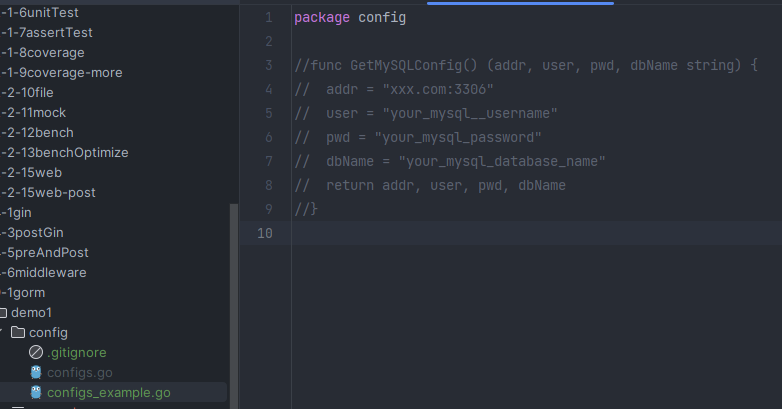
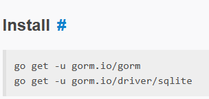
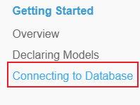
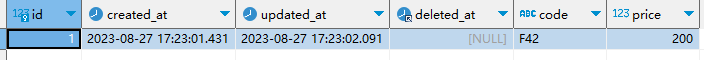

# GORM 框架

本文需要如下基础：

- 熟悉数据库的增删改查操作
- 熟悉go语言基本语法，了解go依赖管理

参考资料汇总：

- GORM官方英文文档 [GORM Guides | GORM - The fantastic ORM library for Golang, aims to be developer friendly.](https://gorm.io/docs/)
- GORM官方中文文档 [GORM 指南 | GORM - The fantastic ORM library for Golang, aims to be developer friendly.](https://gorm.io/zh_CN/docs/)
- MySQL GORM驱动文档 [go-gorm/mysql: GORM mysql driver (github.com)](https://github.com/go-gorm/mysql)

# Manual

## 环境准备

### 案例 9-1 准备MySQL数据库

此次项目我们都以MySQL数据库做gorm框架的测试，当然，你用其他数据库也是可以的，只要在相应步骤修改成相应的数据库驱动，并按要求填写驱动参数即可。

如果没有没有MySQL数据库的同学，可以自行安装MySQL，或者使用云端数据库。MySQL安装还是有一点难度的，建议新手使用现成的云MySQL

这里有一个免费申请云MySQL的网站：[SQLPub - 免费的MySQL数据库](https://sqlpub.com/#/)，由于这个数据库安全性未知，大家不要存放未知数据。~~（我们的目的只是薅羊毛）~~

---

现在MySQL数据库已经准备好了，您将需要使用到：

- 数据库地址
- 数据库用户名
- 数据库密码
- 数据库名称

为了检验数据库的有效性和方便以后查看数据，请使用workbench、navicat、DBeaver等工具查看数据库。

## GORM MySQL入门

### 案例 9-2 MySQL连接入门DEMO

1. 现在我们先创建一个空文件夹(自定义英文名)，作为工程根目录。

2. 在根目录执行指令`go mod init demo`

3. 接着在根目录创建一个config文件夹，再在内创建configs.go文件，写入以下内容：

   ```go
   package config
   
   func GetMySQLConfig() (addr, user, pwd, dbName string) {
   	addr = "xxx.com:3306"
   	user = "your_mysql__username"
   	pwd = "your_mysql_password"
   	dbName = "your_mysql_database_name"
   	return addr, user, pwd, dbName
   }
   ```

4. 为了防止数据库敏感信息被提交到git，我们需要在git处理时忽略这个configs.go文件

5. 在config文件夹下创建文件`.gitignore`(注意开头就是一个'.')，在该文件写入

   ```
   configs.go
   ```

   这样configs.go就不会被git追踪了

6. 如果你还是希望能够提交这个文件，以免自己下次拉取代码时忘了怎么写这个函数，你可以像我一样写一个example文件放在旁边，复制原来的代码，修改敏感的信息，并**注释**起来。这样这个副本文件就可以提交到git仓库里面了，下次复制这个副本文件并解除注释，写入相关信息就可以直接用了。

   

7. 参考[GORM Guides](https://gorm.io/docs/)中我们需要安装gorm依赖和数据库依赖，由于我们使用的是MySQL而非sqlite，所以我们只执行第一条语句安装gorm依赖，而数据库依赖我们需要另找。

8. 在根目录运行指令`go get -u gorm.io/gorm`安装gorm依赖

9. 在[GORM Guides](https://gorm.io/docs/)左侧的目录中可以找到连接其他数据库的具体操作，请自行浏览一遍

10. 打开 [GORM mysql driver (github.com)](https://github.com/go-gorm/mysql)文档，找到下载驱动的命令和操作指南并浏览。

11. 在根目录中运行`go get -u gorm.io/driver/mysql`

12. 在根目录创建main.go文件，参考gorm文档，复制Quick Start的代码放到main.go中

    ```go
    package main
    
    import (
      "gorm.io/gorm"
      "gorm.io/driver/sqlite"
    )
    
    type Product struct {
      gorm.Model
      Code  string
      Price uint
    }
    
    func main() {
      db, err := gorm.Open(sqlite.Open("test.db"), &gorm.Config{})
      if err != nil {
        panic("failed to connect database")
      }
    
      // Migrate the schema
      db.AutoMigrate(&Product{})
    
      // Create
      db.Create(&Product{Code: "D42", Price: 100})
    
      // Read
      var product Product
      db.First(&product, 1) // find product with integer primary key
      db.First(&product, "code = ?", "D42") // find product with code D42
    
      // Update - update product's price to 200
      db.Model(&product).Update("Price", 200)
      // Update - update multiple fields
      db.Model(&product).Updates(Product{Price: 200, Code: "F42"}) // non-zero fields
      db.Model(&product).Updates(map[string]interface{}{"Price": 200, "Code": "F42"})
    
      // Delete - delete product
      db.Delete(&product, 1)
    }
    ```

13. 然后我们修改导入的数据库驱动包为MySQL

    ```go
    import (
    	"gorm.io/driver/mysql"
    	"gorm.io/gorm"
    )
    ```

14. 然后查阅[Connecting to a Database | GORM](https://gorm.io/docs/connecting_to_the_database.html)文档，把main函数的首行改成以下两行

    ```go
    dsn := "user" + ":" + "pass" + "@tcp(" + "127.0.0.1:3306" + ")/" + "dbname" + "?charset=utf8mb4&parseTime=True&loc=Local"
    db, err := gorm.Open(mysql.Open(dsn), &gorm.Config{})
    ```

15. 接着，我们通过把配置文件的MySQL信息导入进来，并修改`dsn`变量的值

    1. ```go
       import "demo/config"
       ```

    3. ```go
       var addr, user, pwd, dbName string = config.GetMySQLConfig()
       dsn := user + ":" + pwd + "@tcp(" + addr + ")/" + dbName + "?charset=utf8mb4&parseTime=True&loc=Local"
       ```

16. 把main函数最后面的一行代码注释掉（不然执行完就删除了数据，看不到测试效果）。

17. 运行main函数，然后查看数据库是否创建了一个新表以及表内多了一行新的数据。

18. 到此，本案例结束。最终代码可参考 [src/9-1gorm/demo1](../src/9-1gorm/demo1)


