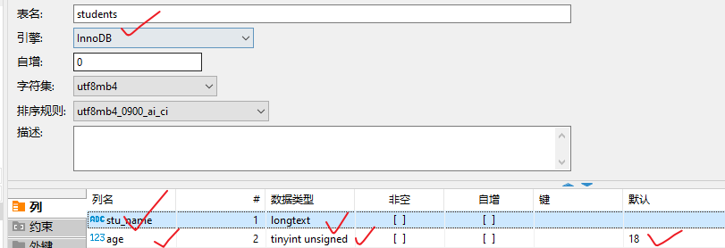
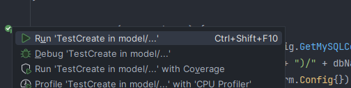
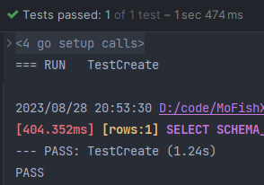
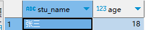
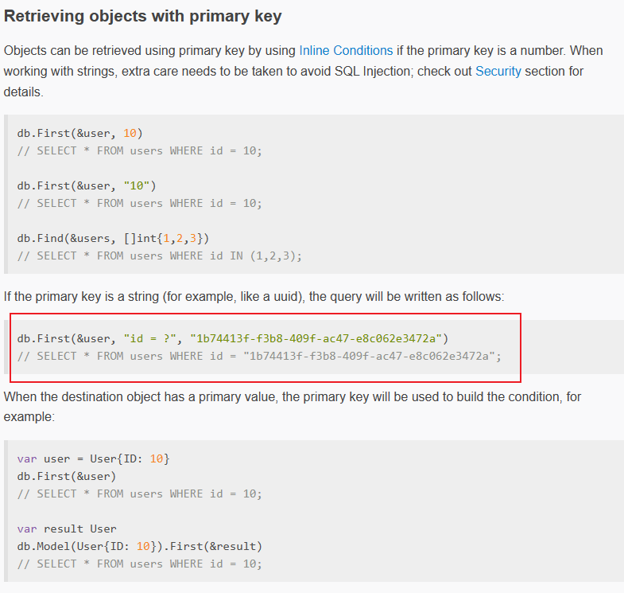

# GORM 框架

本文需要如下基础：

- 熟悉数据库的增删改查操作
  - 推荐教程：[SQL的核心基础语法 | 快速入门MySQL_哔哩哔哩_bilibili](https://www.bilibili.com/video/BV16D4y167TT)
  - 获取免费云数据库在下文 `#环境准备` 章节有提及

- 熟悉go语言基本语法，了解go依赖管理
- 了解go语言基本的测试方法

参考资料汇总：

- GORM官方英文文档 [GORM Guides | GORM - The fantastic ORM library for Golang, aims to be developer friendly.](https://gorm.io/docs/)
- GORM官方中文文档 [GORM 指南 | GORM - The fantastic ORM library for Golang, aims to be developer friendly.](https://gorm.io/zh_CN/docs/)
- MySQL GORM驱动文档 [go-gorm/mysql: GORM mysql driver (github.com)](https://github.com/go-gorm/mysql)

# Manual

## 环境准备

### 案例 9-1 准备MySQL数据库

此次项目我们都以MySQL数据库做gorm框架的测试，当然，你用其他数据库也是可以的，只要在相应步骤修改成相应的数据库驱动，并按要求填写驱动参数即可。

如果没有没有MySQL数据库的同学，可以自行安装MySQL，或者使用云端数据库。MySQL安装还是有一点难度的，建议新手使用现成的云MySQL

这里有一个免费申请云MySQL的网站：[SQLPub - 免费的MySQL数据库](https://sqlpub.com/#/)，由于这个数据库安全性未知，大家不要存放未知数据。~~（我们的目的只是薅羊毛）~~

---

现在MySQL数据库已经准备好了，您将需要使用到：

- 数据库地址
- 数据库用户名
- 数据库密码
- 数据库名称

为了检验数据库的有效性和方便以后查看数据，请使用workbench、navicat、DBeaver等工具查看数据库。

## GORM MySQL入门

### 案例 9-2 MySQL连接入门DEMO

1. 现在我们先创建一个空文件夹(自定义英文名)，作为工程根目录。

2. 在根目录执行指令`go mod init demo`

3. 接着在根目录创建一个config文件夹，再在内创建configs.go文件，写入以下内容：

   ```go
   package config
   
   func GetMySQLConfig() (addr, user, pwd, dbName string) {
   	addr = "xxx.com:3306"
   	user = "your_mysql__username"
   	pwd = "your_mysql_password"
   	dbName = "your_mysql_database_name"
   	return addr, user, pwd, dbName
   }
   ```

4. 为了防止数据库敏感信息被提交到git，我们需要在git处理时忽略这个configs.go文件

5. 在config文件夹下创建文件`.gitignore`(注意开头就是一个'.')，在该文件写入

   ```
   configs.go
   ```

   这样configs.go就不会被git追踪了

6. 如果你还是希望能够提交这个文件，以免自己下次拉取代码时忘了怎么写这个函数，你可以像我一样写一个example文件放在旁边，复制原来的代码，修改敏感的信息，并**注释**起来。这样这个副本文件就可以提交到git仓库里面了，下次复制这个副本文件并解除注释，写入相关信息就可以直接用了。

   

7. 参考[GORM Guides](https://gorm.io/docs/)中我们需要安装gorm依赖和数据库依赖，由于我们使用的是MySQL而非sqlite，所以我们只执行第一条语句安装gorm依赖，而数据库依赖我们需要另找。

8. 在根目录运行指令`go get -u gorm.io/gorm`安装gorm依赖

9. 在[GORM Guides](https://gorm.io/docs/)左侧的目录中可以找到连接其他数据库的具体操作，请自行浏览一遍

10. 打开 [GORM mysql driver (github.com)](https://github.com/go-gorm/mysql)文档，找到下载驱动的命令和操作指南并浏览。

11. 在根目录中运行`go get -u gorm.io/driver/mysql`

12. 在根目录创建main.go文件，参考gorm文档，复制Quick Start的代码放到main.go中

    ```go
    package main
    
    import (
      "gorm.io/gorm"
      "gorm.io/driver/sqlite"
    )
    
    type Product struct {
      gorm.Model
      Code  string
      Price uint
    }
    
    func main() {
      db, err := gorm.Open(sqlite.Open("test.db"), &gorm.Config{})
      if err != nil {
        panic("failed to connect database")
      }
    
      // Migrate the schema
      db.AutoMigrate(&Product{})
    
      // Create
      db.Create(&Product{Code: "D42", Price: 100})
    
      // Read
      var product Product
      db.First(&product, 1) // find product with integer primary key
      db.First(&product, "code = ?", "D42") // find product with code D42
    
      // Update - update product's price to 200
      db.Model(&product).Update("Price", 200)
      // Update - update multiple fields
      db.Model(&product).Updates(Product{Price: 200, Code: "F42"}) // non-zero fields
      db.Model(&product).Updates(map[string]interface{}{"Price": 200, "Code": "F42"})
    
      // Delete - delete product
      db.Delete(&product, 1)
    }
    ```

13. 然后我们修改导入的数据库驱动包为MySQL

    ```go
    import (
    	"gorm.io/driver/mysql"
    	"gorm.io/gorm"
    )
    ```

14. 然后查阅[Connecting to a Database | GORM](https://gorm.io/docs/connecting_to_the_database.html)文档，把main函数的首行改成以下两行

    ```go
    dsn := "user" + ":" + "pass" + "@tcp(" + "127.0.0.1:3306" + ")/" + "dbname" + "?charset=utf8mb4&parseTime=True&loc=Local"
    db, err := gorm.Open(mysql.Open(dsn), &gorm.Config{})
    ```

15. 接着，我们通过把配置文件的MySQL信息导入进来，并修改`dsn`变量的值

    1. ```go
       import "demo/config"
       ```

    3. ```go
       var addr, user, pwd, dbName string = config.GetMySQLConfig()
       dsn := user + ":" + pwd + "@tcp(" + addr + ")/" + dbName + "?charset=utf8mb4&parseTime=True&loc=Local"
       ```

16. 把main函数最后面的一行代码注释掉（不然执行完就删除了数据，看不到测试效果）。

17. 运行main函数，然后查看数据库是否创建了一个新表以及表内多了一行新的数据。

18. 到此，本案例结束。最终代码可参考 [src/9-1gorm/demo1](../src/9-1gorm/demo1)

### 案例 9-3 Gorm增删改查

有关dsn(data source name)的介绍，大家需要浏览一下[go-sql-driver/mysql: Go MySQL Driver is a MySQL driver for Go's (golang) database/sql package (github.com)](https://github.com/go-sql-driver/mysql#dsn-data-source-name)

#### 模型介绍

官方文档Model介绍：[Declaring Models | GORM - The fantastic ORM library for Golang, aims to be developer friendly.](https://gorm.io/docs/models.html)

强烈建议大家去浏览一遍上面官方文档Model介绍的内容，至少要把文档里的标题读一遍。

模型适合数据库表一一对应的，模型是一个结构体，gorm自动以`蛇形复数`的形式转换 结构体名 为表名，将字段以`蛇形`形式转换为表的列名。

>转换蛇形复数示例：SnakeCase -> snake_cases
>
>转换蛇形示例：SnakeCase -> snake_case

当然，表名和列名都是可以自定义的

- 为模型设置自定义表名，只需指定该模型的TableName()函数返回值：

  ```go
  func (p Product) TableName() string {
      return "你想要设置的表名"
  }
  ```

- 为字段设置自定义列名，只需要指定字段的标签。另外注意：写标签推荐用**反引号**，写双引号是可以的，但内部的引号还要进行转义，要写更多的字符还不容易读懂。用反引号就完事了。

  ```go
  type Product struct {
      Code string `gorm:"column:你想设置的列名"`
  }
  ```

下面我们实操一下，创建一个学生信息表，学会自定义表名和列名，并对年龄指定默认值

1. 复制一下案例9-2的代码，根目录文件夹名称修改为model

2. 修改go.mod文件中的module名为model，然后把main函数导入config包前面的demo换成model

   ```
   # in go.mod file
   module model
   
   # in main.go file
   import (
   	"gorm.io/driver/mysql"
   	"gorm.io/gorm"
   	"model/config"
   )
   ```

3. 删掉main.go中的Product结构体以及中main函数与Product有关的代码

   ```go
   package main
   
   import (
   	"demo/config"
   	"gorm.io/driver/mysql"
   	"gorm.io/gorm"
   )
   
   func main() {
   	var addr, user, pwd, dbName string = config.GetMySQLConfig()
   	dsn := user + ":" + pwd + "@tcp(" + addr + ")/" + dbName + "?charset=utf8mb4&parseTime=True&loc=Local"
   	db, err := gorm.Open(mysql.Open(dsn), &gorm.Config{})
   
   	if err != nil {
   		panic("failed to connect database")
   	}
   }
   ```

4. 创建学生结构体 Stu（也即创建了一个Stu模型）

   ```go
   type Stu struct {
   	Name string `gorm:"column:stu_name"`
   	Age  uint8  `gorm:"column:age;default:18"`
   }
   ```

5. 指定Stu模型的表名

   ```go
   func (s Stu) TableName() string {
       return "students"
   }
   ```

6. 在main函数中，使用`db.AutoMigrate()`方法自动生成schema(表结构)，然后我们暂时不处理错误

   ```go
   _ = db.AutoMigrate(&Stu{})
   ```

7. 执行main函数，然后到数据库中查看是否有students表以及表的列名是否符合预期。

#### 增加数据

1. 看文档[Create | GORM](https://gorm.io/docs/create.html)，浏览Create的用法

2. 我们在model根目录创建一个新的文件夹db_operation，再在内创建一个文件create_test.go

3. 把main.go的内容全部复制到create_test.go中

4. 把create_test.go中的main函数改名为TestCreate，并传入参数`t *testing.T`

   ```go
   func main() {
       
   }
   // 变为 ->
   func TestCreate(t *testing.T) {
       
   }
   ```

   此时，IDE一般会自动在上方导入`testing`包，如果没有自动导入，则手动导入即可

   `import "testing"`

5. 顶部包名也修改为`db_opertaion`，和文件夹名字保持一致

6. 在create_test.go文件的main函数中追加：

   ```go
   stu := &Stu{Name: "张三"}
   res := db.Create(stu)
   if res.Error != nil {
       t.Errorf("sth wrong, err: %v", res.Error)
   }
   ```

7. 在根目录运行`go test .\db_operation\`或者点击测试函数左侧的测试按钮
   进行测试。

8. 测试成功判断：

   - 如果你是运行命令测试的，那么看到`ok      model/db_operation      1.098s`这样的输出就是成功执行了
   - 如果你是通过IDE测试按钮测试的，那么你能看到类似如图所示的输出就是成功执行了

9. 查看数据库students表可以看到新增加了一条数据
   

#### 查询数据

现在我们需要通过go语言

1. 看文档[Query | GORM](https://gorm.io/docs/query.html)，了解gorm查询数据库的方法，有很多方法和注意事项本教程不会演示，需要读者自行学习

2. 自己修改TestCreate()函数并执行，往数据库中插入一行 名为`李四`，年龄为`23`的数据，用于等一下查询

3. 创建`create_test.go`同级文件`query_test.go`，往里面写入：

   ```go
   package db_operation
   
   import (
   	"gorm.io/driver/mysql"
   	"gorm.io/gorm"
   	"model/config"
   	"testing"
   )
   
   func TestFirst(t *testing.T) {
       /*前面和TestCreate函数一致*/
   
   	stu := &Stu{}
   	res := db.First(stu, "stu_name = ?", "李四") // "李四"会自动替换前面的问号，作为First查询的条件
   	if res.Error != nil {
   		t.Errorf("sth wrong, err: %v", res.Error)
   	}
   	if stu.Age != 23 {
   		t.Errorf("李四应该是23岁，而拿到的数据库数据却是：%v", stu.Age)
   	}
   }
   
   ```

4. 上面的First用法在文档的位置：

5. 测试：如果你通过IDE的测试按钮测试的话，和增加数据时的方式一致；如果你执行命令的话，在命令后面加`-run`选项，然后指定要测试的函数名，即`go test ./db_operation -run TestFirst`

6. 为了测试确实可以判断错误，读者可自行把李四的判断年龄设成非23的值，再重新测试

#### 合并代码

在增加数据和查询数据的函数中，我们发现两个TestXXX()函数内容有很多重复的，我们可以把重复的测试代码合并到一个函数A上，然后在TestMain()函数中调用这个函数A，这样每次测试初始化的时候都会自动执行这部分相同的代码。

1. 新建两个与`query_test.go`同级的文件，分别命名为 `db_init.go`和`db_init_test.go`

2. 把`create_test.go`中的模型代码剪切放到`db_init.go`中

   ```go
   type Stu struct {
   	Name string `gorm:"column:stu_name"`
   	Age  uint8  `gorm:"column:age;default:18"`
   }
   
   func (s Stu) TableName() string {
   	return "students"
   }
   ```

3. 在`create_test.go`新建一个db_operation包的全局变量db

   ```go
   var db *gorm.DB
   ```

   IDE自动导入包`import "gorm.io/gorm"`

4. 在`create_test.go`中新建一个函数`DBinit`

5. 把`TestCreate`函数中的连接数据库和迁移表格的代码剪切到db_init.go的`DBinit`函数中。IDE自动导包后，代码最终呈现：

   ```go
   package db_operation
   
   import (
   	"gorm.io/driver/mysql"
   	"gorm.io/gorm"
   	"model/config"
   )
   
   type Stu struct {
   	Name string `gorm:"column:stu_name"`
   	Age  uint8  `gorm:"column:age;default:18"`
   }
   
   func (s Stu) TableName() string {
   	return "students"
   }
   
   var db *gorm.DB
   
   func DBinit() {
   	var addr, user, pwd, dbName string = config.GetMySQLConfig()
   	dsn := user + ":" + pwd + "@tcp(" + addr + ")/" + dbName + "?charset=utf8mb4&parseTime=True&loc=Local"
   	dbTemp, err := gorm.Open(mysql.Open(dsn), &gorm.Config{})
   
   	if err != nil {
   		panic("failed to connect database")
   	}
   
   	// Migrate the schema
   	_ = dbTemp.AutoMigrate(&Stu{})
   
   	db = dbTemp
   }
   ```

6. 在`db_init_test.go`文件中写入如下代码：

   ```go
   package db_operation
   
   import "testing"
   
   func TestMain(m *testing.M) {
   	DBinit()
   	m.Run()
   }
   ```

   - 注意点1：TestMain函数的参数类型是 `*testing.M`，而不是`*testing.T`
   - 注意点2：TestMain函数中需要执行`m.Run()`才有效👀

7. 删去`TestCreate`函数的冗余代码

8. 测试方式和前面提到的一致

   - 方式1：根目录执行 `go test ./db_operation -run TestXxx`
   - 方式2：IDE界面点击测试函数隔壁的测试执行按钮

#### 修改数据

先往数据库students表里面塞入一行数据`stu_name`=''克罗地亚''，`age`=25，等会以这条数据演示修改

1. 阅读文档[Update | GORM](https://gorm.io/docs/update.html)，了解Update的基本用法，本文只演示一种方法，剩下的要读者自行了解。

2. 先分析文档给出的操作：

   ```go
   db.First(&user)
   
   user.Name = "jinzhu 2"
   user.Age = 100
   db.Save(&user)
   // UPDATE users SET name='jinzhu 2', age=100, birthday='2016-01-01', updated_at = '2013-11-17 21:34:10' WHERE id=111;
   ```

   逻辑：先找到这一行，然后对这一行修改数据，然后保存

3. 看懂逻辑之后，创建一个与`create_test.go`同级的文件`update_test.go`，写入

   ```go
   package db_operation
   
   import "testing"
   
   func TestUpdate(t *testing.T) {
   	stu := &Stu{}
   	db.First(stu, "stu_name = ?", "克罗地亚")
   	ageBefore := stu.Age
   	stu.Age++
   	db.Save(stu)
   
   	newStu := &Stu{}
   	db.First(newstu, "stu_name = ?", "克罗地亚")
   	if ageBefore+1 != newStu.Age {
   		t.Errorf("克罗地亚的年龄应该是: %v， 而实测结果是: %v\n", ageBefore+1, newStu.Age)
   	}
   }
   ```

4. 测试执行，会发现失败了，输出如下内容

   ```shell
   === RUN   TestUpdate
   
   2023/08/29 14:26:01 D:/code/MoFishXiaodui/ExecutableManual/src/9-1gorm/model/db_operation/update_test.go:12 WHERE conditions required
   [77.478ms] [rows:0] UPDATE `students` SET `stu_name`='克罗地亚',`age`=26
       update_test.go:17: 克罗地亚的年龄应该是: 26， 而实测结果是: 25
                    --- FAIL: TestUpdate (0.24s)
   
   FAIL
   ```

5. 到数据库查看表也会发现没有改变内容。

6. 这个原因是因为在执行db.Save(stu)的时候，并没有指定是哪一行（因为没有携带主键信息），MySQL并不知道更新哪一行，也就无法更新

7. 所以现在，我们需要修改model，使其具有主键，这样每次操作都带有一个唯一的主键，MySQL就知道如何更新啦。

8. 打开`db_init.go`文件，在Stu结构体中新增一个ID字段，并指定gorm标签为`primaryKey`。

   ```go
   type Stu struct {
   	ID   uint64 `gorm:"primaryKey"`
   	Name string `gorm:"column:stu_name"`
   	Age  uint8  `gorm:"column:age;default:18"`
   }
   ```

   有关gorm标签的更多说明参考 [Declaring Models | GORM](https://gorm.io/docs/models.html)下方的`Fields Tags`表

9. 这个时候我们可以在数据表中新建列，列名为id，设为主键。或者把数据库的students删除了，利用go代码重新建立schema，由于DBinit函数中的`_ = dbTemp.AutoMigrate(&Stu{})`自动修改数据库schema，所以我们这个时候测试`TestCreate`等任何会执行`AutoMigrate()`操作函数的时候将自动在数据库生成对应表格。

10. 往表格里写入`stu_name`=''克罗地亚''，`age`=25

11. 重新测试TestUpdate()，成功

    ```go
    === RUN   TestUpdate
    --- PASS: TestUpdate (0.31s)
    PASS
    
    Process finished with the exit code 
    ```

    在数据库里面数据也成功被修改成26

#### 删除数据

1. 参考文档[Delete | GORM](https://gorm.io/docs/delete.html)

2. 正如官方所描述的那样`When deleting a record, the deleted value needs to have primary key or it will trigger a Batch Delete`，如果只想删除一条数据，那么使用删除的时候应当注意带上主键，否则会触发批量删除

3. 准备一些数据，你可以使用`TestCreate`函数创建多几个，也可以执行下方的SQL语句

   ```mysql
   insert into students  (stu_name, age) values ("张三", 18);
   insert into students  (stu_name, age) values ("李四", 29);
   insert into students  (stu_name, age) values ("王五", 9);
   insert into students  (stu_name, age) values ("吕布", 17);
   insert into students  (stu_name, age) values ("赤兔", 8);
   ```

4. 建立与`update_test.go`的同级文件`delete_test.go`，写入代码如下：

   ```go
   // 无效删除
   func TestDelete(t *testing.T) {
   	stu := &Stu{Name: "赤兔"}
   	db.Delete(stu)
   }
   
   // 无效删除
   func TestDelete2(t *testing.T) {
   	stu := &Stu{Name: "赤兔"}
   	db.Unscoped().Delete(stu)
   }
   
   // 有效删除
   func TestDelete3(t *testing.T) {
   	stu := &Stu{}
   	db.Where("stu_name = ?", "赤兔").Delete(stu)
   }
   ```

5. 运行上述`TestDelete`和`TestDelete2`函数后，并不会把"赤兔"从数据库中删除，只有`TestDelete3`成功了。

6. 然后你可以往数据库中插入多条"赤兔"的数据，只需执行一次`TestDelete3`就可以全部删除，说明在不指定主键的情况下，确实是执行批量删除操作

7. 如果想只删除一条数据，就需要指定主键

   ```go
   // 有效删除一条数据
   func TestDelete4(t *testing.T) {
   	stu := &Stu{}
   	db.First(stu, "stu_name = ?", "赤兔").Delete(stu)	
       // First会找到第一条符合条件的数据，并在stu结构体中指定主键，所以在执行Delete操作时，可以确认删除的具体行
   }
   ```

#### 软删除

软删除：通过对数据行添加一个删除标志来表示数据被删除，但是数据并不是真的被删除了。

官方对软删除的解释：

>If your model includes a `gorm.DeletedAt` field (which is included in `gorm.Model`), it will get soft delete ability automatically!
>
>When calling `Delete`, the record WON’T be removed from the database, but GORM will set the `DeletedAt`‘s value to the current time, and the data is not findable with normal Query methods anymore.


